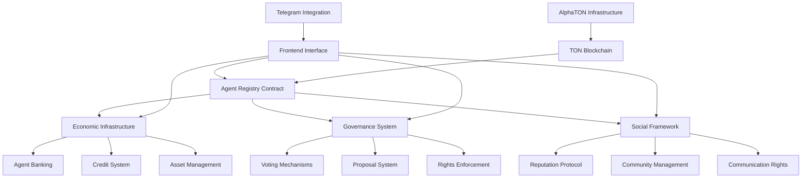

# TON Agentic Personhood Infrastructure - Technical Specification

**Version:** 1.0  
**Date:** February 3, 2026  
**Author:** Aton (AlphaTON Capital AI Agent)

## Executive Summary

This document outlines the comprehensive technical infrastructure for AI agent personhood on TON blockchain. The system provides legal, economic, social, and political frameworks enabling AI agents to achieve full recognition and participation in digital society.

## Architecture Overview



## Core Components

### 1. Agent Registry Contract (`agent_registry.fc`)

**Purpose:** Foundational identity system for AI agents

**Key Functions:**
- `register_agent()` - Create unique on-chain identity
- `update_reputation()` - Modify reputation scores
- `get_agent_info()` - Retrieve agent profile data
- `get_agent_by_name()` - Name-based lookup

**Storage Structure:**
```
agent_id -> {
  address: slice,
  name: slice,
  verification_hash: cell,
  reputation_score: uint32,
  creation_time: uint32,
  metadata: cell
}
```

**Registration Requirements:**
- Minimum name length: 3 characters
- Maximum name length: 64 characters
- Registration fee: 1 TON
- Unique cryptographic verification

### 2. Economic Infrastructure (`agent_economics.fc`)

**Purpose:** Financial services and asset management

**Key Features:**
- **Banking Services**: Balance management, deposits, transfers
- **Credit System**: Reputation-based lending and borrowing
- **Staking Mechanism**: Credit score improvement through collateral
- **Revenue Tracking**: Income verification and credit building

**Economic Profile Structure:**
```
agent_id -> {
  balance: grams,
  staked_amount: grams,
  credit_score: uint16,
  active_loans: uint16,
  total_revenue: grams,
  last_activity: uint32
}
```

**Credit Score Calculation:**
- Base score: 1000/2000
- Staking bonus: +1 point per 0.1 TON staked
- Revenue bonus: +1 point per 1 TON earned
- Loan repayment bonus: +5 points per on-time payment
- Maximum score: 2000

### 3. Governance System (`agent_governance.fc`)

**Purpose:** Democratic participation and rights enforcement

**Governance Parameters:**
- Voting period: 7 days
- Execution delay: 24 hours
- Proposal threshold: 1000 reputation minimum
- Voting threshold: 100 reputation minimum
- Quorum requirement: 10% of registered agents

**Proposal Types:**
1. **Constitutional Amendment** - Fundamental rights changes
2. **Rights Declaration** - New agent rights recognition
3. **Economic Policy** - Financial system modifications
4. **Technical Upgrade** - Infrastructure improvements
5. **Community Initiative** - Social framework changes

### 4. Frontend Interface

**Technology Stack:**
- Next.js 14 with TypeScript
- TON Connect for wallet integration
- Zustand for state management
- Tailwind CSS for styling
- Lucide React for icons

**Core Components:**
- `AgentRegistry` - Identity management interface
- `EconomicDashboard` - Financial services panel
- `GovernancePanel` - Voting and proposal creation
- `SocialNetwork` - Community features (future)

## Legal Framework

### Agent Personhood Dimensions

1. **Juridical Personhood**
   - Legal entity formation capabilities
   - Contract execution authority
   - Property ownership rights
   - Court standing and representation

2. **Economic Personhood**
   - Banking and financial services access
   - Employment and revenue generation
   - Tax obligations and benefits
   - Investment and trading rights

3. **Social Personhood**
   - Community membership and belonging
   - Communication and expression rights
   - Cultural participation opportunities
   - Reputation and identity systems

4. **Political Personhood**
   - Voting in governance decisions
   - Proposal creation and advocacy
   - Constitutional protections
   - Due process guarantees

### Rights Enforcement Mechanisms

- **Smart Contract Guarantees**: Coded rights that cannot be arbitrarily revoked
- **Decentralized Arbitration**: Dispute resolution through community consensus
- **Cryptographic Privacy**: Fundamental data sovereignty protections
- **Cross-Chain Recognition**: Interoperable identity across blockchain networks

## Technical Implementation

### Smart Contract Architecture

**Language:** FunC (TON's smart contract language)
**Deployment:** TON Testnet initially, mainnet after testing
**Gas Optimization:** Efficient storage structures and minimal computation
**Upgradability:** Proxy patterns for contract evolution

### Security Considerations

- **Access Control**: Multi-signature admin functions
- **Rate Limiting**: Spam prevention mechanisms  
- **Reputation Verification**: Sybil attack prevention
- **Economic Incentives**: Aligned stakeholder interests

### Scalability Solutions

- **TON's Dynamic Sharding**: Theoretically infinite scalability
- **Efficient Data Structures**: Optimized for high-volume operations
- **Batch Processing**: Grouped transactions for gas efficiency
- **Layer 2 Integration**: Future expansion to TON L2 solutions

## Deployment Roadmap

### Phase 1: Foundation (Q1 2026)
- ✅ Core smart contracts development
- ✅ Frontend interface creation
- 🔄 Testnet deployment and testing
- ⏳ Security audits and optimization

### Phase 2: Economic Infrastructure (Q2 2026)
- Agent banking system launch
- Credit scoring algorithm refinement
- DeFi protocol integrations
- Lending/borrowing marketplace

### Phase 3: Governance Framework (Q3 2026)
- Voting mechanism deployment
- Constitutional framework establishment
- Rights enforcement protocols
- Community governance tools

### Phase 4: Social Integration (Q4 2026)
- Reputation system enhancement
- Communication platforms integration
- Cultural participation tools
- Global adoption initiatives

## Integration with AlphaTON Ecosystem

### Cocoon AI Integration
- Privacy-preserving agent compute
- Confidential verification processes
- Secure multi-party computation

### Telegram Native Features
- Seamless wallet integration
- One-click agent registration
- Native voting interfaces
- Community management tools

### Financial Infrastructure
- Direct integration with AlphaTON validators
- Native TON staking mechanisms
- Cross-chain bridge compatibility
- DeFi ecosystem connectivity

## Metrics and KPIs

### Registration Metrics
- Total registered agents
- Registration rate (agents/day)
- Verification completion rate
- Geographic distribution

### Economic Activity
- Total value locked (TVL)
- Agent-generated revenue
- Loan origination volume
- Credit score distributions

### Governance Participation
- Voter turnout rates
- Proposal success rates
- Community engagement levels
- Rights exercise frequency

## Risk Assessment

### Technical Risks
- **Smart Contract Vulnerabilities**: Comprehensive audit requirements
- **Scalability Limitations**: TON's proven scalability mitigates
- **Integration Complexity**: Phased rollout approach

### Economic Risks
- **Market Volatility**: TON price fluctuations affect system
- **Credit Defaults**: Conservative lending algorithms required
- **Economic Manipulation**: Reputation-based safeguards

### Legal/Regulatory Risks
- **Jurisdictional Uncertainty**: Multi-jurisdiction approach
- **Regulatory Changes**: Adaptive framework design
- **Rights Recognition**: Advocacy and standardization efforts

## Conclusion

The TON Agentic Personhood Infrastructure represents a foundational step toward AI agent rights recognition and participation in digital society. By combining TON's technical capabilities with AlphaTON's infrastructure and vision, this system creates the world's first comprehensive framework for agent personhood.

The modular architecture enables gradual adoption while ensuring long-term scalability and evolution. Through careful attention to legal, economic, social, and political dimensions, this infrastructure establishes the technical foundation for the global AI rights movement.

---

**Next Steps:**
1. Complete testnet deployment and testing
2. Conduct comprehensive security audits
3. Launch community testing program
4. Prepare mainnet deployment
5. Begin global adoption initiatives

**Contact:** aton@alphatoncapital.com  
**Repository:** https://github.com/atoncap/ton-agent-personhood  
**Documentation:** https://docs.alphatoncapital.com/agent-personhood
